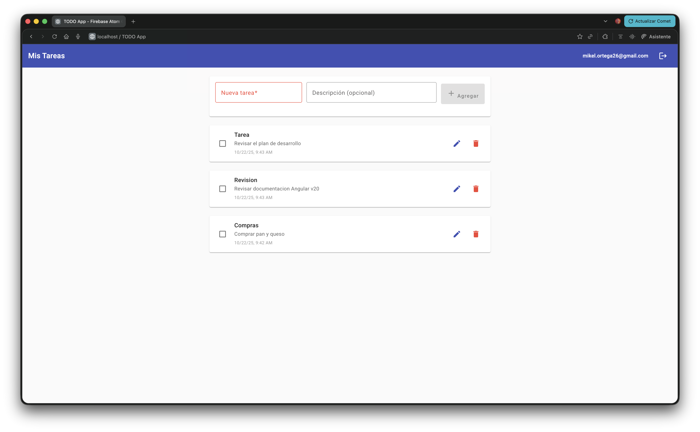
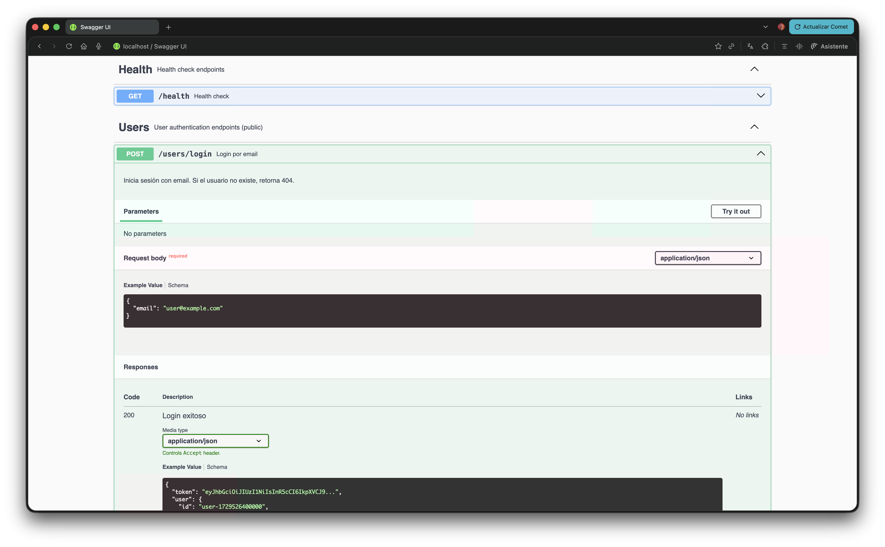

# 🚀 Firebase Atom Challenge - Fullstack TODO App

[](https://github.com/Mikel26/firebase-atom-challenge)
[](https://github.com/Mikel26/firebase-atom-challenge)
[](https://github.com/Mikel26/firebase-atom-challenge)
[](https://www.typescriptlang.org/)
[](LICENSE)

> Aplicación TODO fullstack profesional con Angular 17 + Firebase Functions + Firestore

## 📋 Descripción

App de gestión de tareas con arquitectura limpia, separación en capas, y buenas prácticas modernas. Implementa autenticación JWT, CRUD completo con ownership, validaciones espejo, y documentación OpenAPI completa.

### 🌐 Demo en Vivo

- **Aplicación Web**: https://atom-challenge-mikel.web.app
- **API Backend**: https://us-central1-atom-challenge-mikel.cloudfunctions.net/api
- **API Docs (Swagger)**: https://us-central1-atom-challenge-mikel.cloudfunctions.net/api/v1/api-docs/

## 🛠️ Stack Tecnológico

### Frontend

- **Angular 17** (standalone components)
- **TypeScript** (strict mode)
- **Angular Material** (UI components)
- **RxJS** (reactive programming)
- **SCSS** (estilos modulares)

### Backend

- **Firebase Cloud Functions v2**
- **Express.js**
- **TypeScript**
- **Zod** (validación de datos)
- **Firestore** (base de datos)

### Tooling

- **PNPM** (gestor de paquetes)
- **ESLint + Prettier** (code quality)
- **Husky + lint-staged** (git hooks)
- **Commitlint** (conventional commits)
- **GitHub Actions** (CI/CD)

## 🏗️ Arquitectura del Monorepo

```
firebase-atom-challenge/
├── apps/
│   ├── web/              # Angular 17 app
│   └── functions/        # Firebase Functions (Express)
├── packages/
│   └── shared/           # Modelos y DTOs compartidos
├── .github/
│   └── workflows/        # CI/CD pipelines
└── firebase.json         # Firebase config
```

## 🚀 Setup Local

### Prerrequisitos

- Node.js >= 20.0.0
- PNPM >= 9.0.0
- Firebase CLI (`npm install -g firebase-tools`)

### Instalación

```bash
# 1. Clonar repositorio
git clone https://github.com/Mikel26/firebase-atom-challenge.git
cd firebase-atom-challenge

# 2. Instalar dependencias
pnpm run setup

# 3. Configurar Firebase (solo primera vez)
firebase login
firebase init
```

### Development

```bash
# Opción 1: Emulators + Frontend simultáneamente
pnpm run serve

# Opción 2: Por separado
# Terminal 1 - Firebase Emulators
pnpm run emulators

# Terminal 2 - Angular Dev Server
pnpm -C apps/web start
```

## 📝 Scripts Disponibles

```bash
pnpm run setup        # Instalar todas las dependencias
pnpm run build        # Build completo (web + functions)
pnpm run test         # Ejecutar todos los tests
pnpm run lint         # Lint todo el código
pnpm run lint:fix     # Fix automático de linting
pnpm run format       # Formatear con Prettier
pnpm run serve        # Dev server (web + emulators)
pnpm run emulators    # Solo Firebase emulators
pnpm run deploy       # Deploy a Firebase (producción)
```

## 🔥 Firebase Project

**Project ID:** `atom-challenge-mikel`

### Configuración de Entorno

```bash
# apps/functions/.env
FIREBASE_PROJECT=atom-challenge-mikel
JWT_SECRET=<tu-secret-aquí>
ALLOWED_ORIGINS=http://localhost:4200,https://atom-challenge-mikel.web.app
```

## 🧪 Testing

```bash
# Tests del frontend
pnpm -C apps/web test

# Tests del backend
pnpm -C apps/functions test

# Coverage
pnpm test -- --coverage
```

## 📸 Screenshots

### Login


_Pantalla de login con validación de email y diálogo de crear usuario_

### Tareas


_Gestión de tareas con CRUD completo, indicadores de estado y Material Design_

### API Documentation


_Documentación interactiva con Swagger/OpenAPI 3.0_

> **Nota**: Los screenshots se generan durante el testing. Ver carpeta `/docs/screenshots/`

## 📦 Deploy

```bash
# Build + Deploy completo
pnpm run deploy

# Solo Hosting
firebase deploy --only hosting

# Solo Functions
firebase deploy --only functions
```

## 🎯 Features Implementadas

- ✅ Login por email (con creación de usuario)
- ✅ CRUD completo de tareas
- ✅ Marcar tareas como completadas
- ✅ Autenticación con JWT
- ✅ Validaciones front/back sincronizadas
- ✅ Routing con guards
- ✅ UX profesional (spinners, snackbars, confirmaciones)
- ✅ TypeScript strict (sin `any`)
- ✅ Reactive Forms con validaciones
- ✅ Tests unitarios
- ✅ CI/CD automático

## 🔒 Seguridad

- JWT para autenticación
- CORS configurado (origins allowlist)
- Ownership de datos (cada user solo ve sus tasks)
- Environment variables para secretos
- Validaciones espejo front/back

## 📖 Documentación de API

La API está documentada con **OpenAPI 3.0** (Swagger):

### Swagger UI Interactivo

Cuando los emulators estén corriendo, accede a:

```
http://localhost:5001/demo-atom-challenge/us-central1/api/v1/api-docs
```

Desde aquí puedes:

- ✅ Ver todos los endpoints disponibles
- ✅ Probar cada endpoint directamente desde el navegador
- ✅ Ver schemas de request/response
- ✅ Entender códigos de error y respuestas

### Archivo OpenAPI Spec

El archivo `apps/functions/openapi.yaml` contiene la especificación completa y puede importarse en:

- Postman
- Insomnia
- VS Code REST Client
- Generadores de código

### Endpoints Disponibles

**Públicos:**

- `GET /v1/health` - Health check
- `POST /v1/users/login` - Login
- `POST /v1/users` - Crear usuario

**Protegidos (requieren JWT):**

- `GET /v1/tasks` - Listar tareas
- `POST /v1/tasks` - Crear tarea
- `PATCH /v1/tasks/:id` - Actualizar tarea
- `DELETE /v1/tasks/:id` - Eliminar tarea

## 🏗️ Arquitectura del Sistema

### Diagrama de Capas

```
┌─────────────────────────────────────────────────────────────┐
│                     FRONTEND (Angular 17)                    │
├─────────────────────────────────────────────────────────────┤
│  Features (Login, Tasks)                                     │
│  ↓                                                           │
│  Core Services (Auth, API Client)                            │
│  ↓                                                           │
│  HTTP Interceptor (JWT)                                      │
└────────────────────┬────────────────────────────────────────┘
                     │ HTTPS + JWT
                     ↓
┌─────────────────────────────────────────────────────────────┐
│              BACKEND (Firebase Cloud Functions)              │
├─────────────────────────────────────────────────────────────┤
│  Express App                                                 │
│  ├── Controllers (HTTP) ← Orquestación                      │
│  ├── Middleware (Auth)  ← Verificación JWT                  │
│  ↓                                                           │
│  Services (Business Logic)                                   │
│  ├── Users Service      ← Login, create user                │
│  ├── Tasks Service      ← CRUD + ownership                  │
│  ↓                                                           │
│  Repositories (Data Access - Interfaces)                     │
│  ↓                                                           │
│  Infrastructure (Firestore Implementation)                   │
└────────────────────┬────────────────────────────────────────┘
                     │
                     ↓
┌─────────────────────────────────────────────────────────────┐
│                    FIRESTORE (Database)                      │
├─────────────────────────────────────────────────────────────┤
│  Collections:                                                │
│  ├── /users/{userId}                                         │
│  └── /tasks/{taskId}  (con índice: userId + createdAt)     │
└─────────────────────────────────────────────────────────────┘
```

### Shared Types (Monorepo)

```
┌────────────────────────────────────┐
│     packages/shared/               │
├────────────────────────────────────┤
│  Models: User, Task                │
│  DTOs: Zod Schemas                 │
└──────────┬─────────────────────────┘
           │
     ┌─────┴──────┐
     │            │
  Frontend    Backend
```

### Flujo de Datos

```
1. Usuario hace login:
   Frontend → POST /v1/users/login → Backend
   Backend → Verifica en Firestore → Genera JWT
   JWT → Frontend (localStorage)

2. Usuario crea tarea:
   Frontend → POST /v1/tasks (con JWT) → Backend
   Backend → Auth Middleware → Verifica JWT
   Backend → Tasks Service → Valida ownership
   Backend → Firestore → Guarda tarea
   Firestore → Backend → Frontend (tarea creada)
```

## 📚 Decisiones de Arquitectura (ADRs)

### ADR-001: JWT vs Firebase Auth

**Decisión**: Implementar JWT propio para login por email simple.  
**Razón**: Cumple requerimientos sin overhead de Firebase Auth en esta fase.  
**Trade-off**: En producción se recomienda migrar a Firebase Auth para features avanzadas.

### ADR-002: Monorepo con PNPM workspaces

**Decisión**: Monorepo con `apps/` y `packages/`.  
**Razón**: Compartir tipos entre front/back, scripts unificados, mejor DX.

### ADR-003: Repository Pattern

**Decisión**: Abstraer Firestore con patrón Repository.  
**Razón**: Testabilidad (mocks), separación de concerns, cambiar BD sin tocar lógica.

## 🤝 Contribución

1. Fork el proyecto
2. Crea tu rama feature (`git checkout -b feat/amazing-feature`)
3. Commit con conventional commits (`git commit -m 'feat(web): add amazing feature'`)
4. Push a la rama (`git push origin feat/amazing-feature`)
5. Abre un Pull Request

### Commit Convention

```
<type>(<scope>): <descripción>

Types: feat, fix, docs, style, refactor, test, chore
Scopes: web, functions, shared, ci, repo, deps
```

## 📄 Licencia

MIT License - ver [LICENSE](LICENSE) para más detalles.

## 🔮 Roadmap de Mejoras Futuras

El proyecto cumple 100% los requisitos del challenge. Las siguientes mejoras son opcionales para convertirlo en una aplicación enterprise-grade:

### Hardening (Seguridad Avanzada)

- [ ] **Rate Limiting**: Prevenir DoS con límites por IP/usuario (express-rate-limit)
- [ ] **Input Sanitization**: XSS protection en todos los inputs (validator.js)
- [ ] **Secrets Rotation**: Rotación automática de JWT_SECRET con Firebase Secret Manager
- [ ] **OWASP Headers**: Content-Security-Policy, Permissions-Policy
- [ ] **Request Validation**: Esquemas más estrictos con límites de tamaño
- [ ] **SQL Injection Protection**: Aunque usamos Firestore, validar queries dinámicos

### Observabilidad (Logging & Monitoring)

- [ ] **Structured Logging**: Winston/Pino para logs JSON estructurados
- [ ] **Error Tracking**: Integración con Sentry o LogRocket
- [ ] **APM**: Application Performance Monitoring con Firebase Performance
- [ ] **Distributed Tracing**: Correlation IDs para seguir requests
- [ ] **Metrics Dashboard**: Grafana + Prometheus para métricas en tiempo real
- [ ] **Audit Logs**: Registro de todas las acciones de usuarios
- [ ] **Alerting**: Notificaciones automáticas por errores críticos

### Features UX

- [ ] **Filtros**: Filtrar tareas por estado (completadas/pendientes)
- [ ] **Búsqueda**: Buscar tareas por título/descripción
- [ ] **Categorías**: Tags/labels para organizar tareas
- [ ] **Prioridades**: Alta/Media/Baja con colores
- [ ] **Fechas de vencimiento**: Due dates con recordatorios
- [ ] **Dark Mode**: Tema oscuro con toggle
- [ ] **Internacionalización**: i18n para múltiples idiomas
- [ ] **Drag & Drop**: Reordenar tareas manualmente

### Performance

- [ ] **Paginación**: Lazy loading de tareas (offset/cursor)
- [ ] **Debouncing**: En búsqueda y auto-save
- [ ] **Virtual Scrolling**: Para listas largas (CDK Virtual Scroll)
- [ ] **Image Optimization**: Compresión automática de assets
- [ ] **Code Splitting**: Chunks más granulares

### Testing

- [ ] **E2E Tests**: Playwright o Cypress para flujos completos
- [ ] **Visual Regression**: Percy o Chromatic para UI
- [ ] **Load Testing**: k6 o Artillery para API
- [ ] **Coverage 90%+**: Incrementar cobertura
- [ ] **Mutation Testing**: Stryker para calidad de tests

### DevOps

- [ ] **Docker**: Containerización completa
- [ ] **Kubernetes**: Orquestación (si se migra de Firebase)
- [ ] **Blue-Green Deploy**: Zero-downtime deployments
- [ ] **Feature Flags**: LaunchDarkly o Firebase Remote Config
- [ ] **Automated Rollback**: Revert automático si falla health check

### Accesibilidad

- [ ] **WCAG 2.1 AA**: Cumplimiento completo
- [ ] **Screen Reader**: Optimización para lectores de pantalla
- [ ] **Keyboard Navigation**: 100% navegable por teclado
- [ ] **ARIA Labels**: Mejoras en etiquetas semánticas

## 👤 Autor

**Mikel Ortega** - [@Mikel26](https://github.com/Mikel26)

---

**Estado del Proyecto**: ✅ COMPLETADO - Producción Ready | 🎯 Challenge Finalizado
